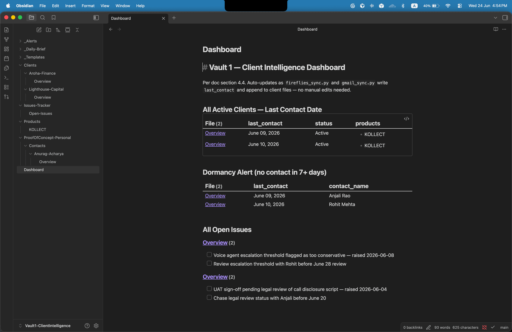

# Predixion Obsidian Sync — MVP

This is a job-assignment submission for Predixion AI: a working build of a
subset of the "Obsidian Intelligence System" internal build plan (a two-vault,
Obsidian-based knowledge system for tracking BFSI clients and BD pipeline),
built from an outsider's vantage point without access to Predixion's actual
tools or client data.

Two things live in this repo:
- **This technical build** — real sync scripts, a populated Obsidian vault,
  a skill library. Documented below.
- **[`Chinmay_Predixion_Thoughts_and_Recommendations.md`](Chinmay_Predixion_Thoughts_and_Recommendations.md)**
  — a separate written opinion on what I'd add on top of this build once it's
  running: rolling Overview synthesis, a suggested-actions file Vaibhav
  adjudicates instead of the agent acting on its own, and why local
  open-weight models make that achievable without a paid cloud dependency
  like xysq. Not part of the build — a standalone take on where this goes
  next.

The build below covers a subset of the brief's sections 3–6. This is **not**
a full implementation. Per HR's guidance, this
assignment is judged on approach and thinking, not completion — building the
real system requires Predixion's actual Outlook/Azure AD, HubSpot, and Slack
access, and real client data, none of which an outside candidate has. What
follows is a real, working slice: two sync scripts, an orchestrator, and a
populated Obsidian vault, with every place this deviates from the brief named
explicitly rather than glossed over.

## What's built vs. what's not


| Doc component                                                            | Status                                                                                                                                                          |
| ------------------------------------------------------------------------ | --------------------------------------------------------------------------------------------------------------------------------------------------------------- |
| Vault 1 — Client Intelligence                                            | Built, populated with 2 mock BFSI clients. Full folder structure per section 4.1, including `Calls/`/`Emails/` subfolders per client, not just `Overview.md`     |
| `fireflies_sync.py`                                                      | Built, runs against the real Fireflies API                                                                                                                      |
| `outlook_sync.py`                                                        | **Not built.** No Outlook/Azure AD access. Replaced by `gmail_sync.py` (see below)                                                                              |
| `hubspot_sync.py`                                                        | **Not built.** No HubSpot access, and Vault 2 (Demand Gen/BD) is out of scope entirely — see "What's deliberately out of scope"                                 |
| `daily_brief.py`                                                         | Built, runs all syncs and generates the brief. Slack push replaced by a real email send (see below)                                                             |
| Vault 2 — Demand Gen / BD                                                | **Not built.** See "What's deliberately out of scope"                                                                                                           |
| Dataview dashboards (section 4.4)                                        | Built — `Dashboard.md`, live queries, verified rendering in real Obsidian                                                                                       |
| Graph view (section 1.3)                                                 | Built — client↔product `[[wikilinks]]` and per-call/per-email files link back to their client, so Graph view shows real relationship edges, not isolated nodes |
| Obsidian plugins (Dataview, Templater, Obsidian Git, QuickAdd, Calendar) | Dataview, Obsidian Git, QuickAdd, and Calendar installed and enabled. Templater's files are present but disabled — its template-on-create flow wasn't exercised against a real client onboarding, so it's left off rather than claimed as working |
| Skill Library (section 8) | Partially built — see `/skill-library` |


*Vault 1 dashboard — dormancy alerts and open issues rendered live via Dataview, not just markdown.*

## Named substitutions

The doc is written against tools (Outlook, Slack, HubSpot) that weren't
available for this build. Every substitution is named here and in code
comments at the point it happens — nothing is silently presented as the real
thing.

1. **Outlook → Gmail.** `gmail_sync.py` does what the doc's `outlook_sync.py`
  (section 6.2) does — pull last-24h messages, match by sender/recipient
   domain, append to the client's `## Email Log` — but against the Gmail API
   instead of Microsoft Graph, since there was no Outlook/Azure AD access.
   Architecturally identical (OAuth installed-app flow either way); the only
   real difference is the API surface.
2. **Slack push → email send.** The doc's `daily_brief.py` (section 6.4)
  optionally posts the brief to a Slack channel via webhook (section 7.2).
   There's no Slack workspace here, so `daily_brief.py` sends the brief as a
   real email via the Gmail API instead. Same "push a finished brief
   somewhere visible" job, different channel.
3. **Mock data, not fake-and-hidden.** `fireflies_sync.py` calls the real
  Fireflies API when `FIREFLIES_API_KEY` is set, and falls back to
   `fixtures/fireflies_mock_response.json` when it isn't — same code path
   either way. The fixture is shaped exactly like the documented schema. Two
   client files (Aroha Finance, Lighthouse Capital) are entirely fictional
   BFSI mocks, built to the doc's section 4.2 template, standing in for
   Predixion's real client roster.
4. **Seeded mock emails, not generated by `gmail_sync.py`.** Unlike Fireflies,
  `gmail_sync.py` has no mock fallback path — it always queries the real
   Gmail API, which obviously has no mail from the two fictional client
   domains. The one `## Email Log` entry per client and its matching
   `Emails/` file were written by hand, in the exact format
   `format_email_entry()`/`write_email_file()` produce, purely so the vault's
   folder structure and Graph view are demonstrable. Run `gmail_sync.py`
   against a real inbox with matching domains and it produces the same shape
   for real.

## A real finding: the doc's API spec doesn't match the live API

Worth flagging on its own, because it's a concrete example of testing a spec
against reality rather than trusting it: the doc (and the mock fixture, built
faithfully to the doc) describes Fireflies' `participants` field as
`[{email, name}]` objects, `action_items` as a list, and `date` as a
`"YYYY-MM-DD"` string. The **real live Fireflies API** returns `participants`
as a flat array of plain email strings, `action_items` as a single string
with embedded newlines, and `date` as epoch milliseconds. Requesting
`participants { email name }` (sub-field selection on what's actually a
scalar array) throws a real `400 Bad Request`. `fireflies_sync.py`'s
`normalize_`* functions handle both shapes, so the mock and the live API run
through identical downstream logic. See `fireflies_sync.py` lines 68–102.

## A spec inconsistency: folder structure vs. append format

Worth flagging on its own. Section 4.1's folder structure shows each client
folder with `Overview.md`, `Calls/`, and `Emails/` subfolders, implying one
file per call/email. But section 6.1/6.2's append-format examples write call
and email summaries as `### Call —` / `### Email —` entries inside
`Overview.md`'s `## Call Log` / `## Email Log` sections — no separate files.
The two sections of the doc don't agree with each other.

Both are now honored: `fireflies_sync.py` and `gmail_sync.py` still append
to `Overview.md` per the section 6.1/6.2 format, and additionally write a
standalone file per call/email into `Calls/`/`Emails/` per the section 4.1
folder structure. Each standalone file links back to its client's
`Overview.md` via a wikilink in frontmatter (`client: "[[...]]"`), so the
relationship shows up as a real edge in Obsidian's Graph view — a plain
frontmatter string wouldn't render as one.

## Graph view: client-to-product links

Frontmatter `products:` lists are plain strings, useful for Dataview's
`contains()` filters but invisible to Graph view — Obsidian only draws edges
from real `[[wikilinks]]` written in file content, not from Dataview query
results or frontmatter strings. Each client's `## Deployment Status` section
now also links the product as `[[KOLLECT]]`, so Graph view shows the actual
client ↔ product relationships the brief's section 1.3 calls out
("visual map of relationships between clients, products, issues, and
prospects") instead of an empty graph of disconnected client nodes.

## What's deliberately out of scope

- **Vault 2 (Demand Gen/BD) and `hubspot_sync.py`.** This requires real
HubSpot deal/contact data and a real prospect list (mPokket, Lighthouse
Learning, etc. from the doc) that an outside candidate doesn't have access
to. Building it against fabricated prospects would be lower-signal than
building Vault 1 well.
- **Cron / Task Scheduler automation (section 3.3, Week 2).** `daily_brief.py`
runs manually here. Wiring a daily 7am cron job is a one-line addition
once this runs on the actual machine it'll live on — not meaningful to
fake in a submission.
- **Obsidian Git → real GitHub remote.** The plugin is installed and
configured with the doc's commit message format and 30-minute interval,
but `disablePush: true` — there's no real GitHub repo to push to here, and
this vault sits inside a personal project's own git repo, so a real remote
would conflict. Configured, not connected.
- **`/kollect-deck` and `/voiz-sop` skill files (section 8.2).** Both require
real KOLLECT/VOIZ deployment specifics (data table formats, escalation flow
details, Predixion's actual brand tone docs) that an outside candidate
doesn't have. Built `/transcript-analysis`, `/email-draft`, `/intern-brief`,
and `/proposal` instead — see `skill-library/`, none of these require
insider data to be done in good faith. One honest caveat on the four that
were built: I don't actually know how Predixion wants its voice to sound
(tone, formality, house style) — these templates make a reasonable generic
guess at "professional enterprise BFSI vendor," not a match to a real brand
voice doc. Treat them as a starting structure to adjust, not a finished
deliverable.

## Proof of concept: the pattern generalizes beyond BFSI

`ProofOfConcept-Personal/Contacts/Anurag-Acharya/Overview.md` is a real,
deliberately separate entity outside the BFSI client vault — same file
pattern (frontmatter, Call Log, contact-level routing), but for a personal
contact instead of a client. It exists to prove `fireflies_sync.py`'s
matching logic generalizes past domain-based BFSI routing: personal contacts
on shared providers (gmail.com) can't be matched by domain the way
`arohafinance.in` can, since gmail.com isn't a single entity. `fireflies_sync.py`
handles this via a separate `EMAIL_TO_CLIENT` dict (exact-email match,
checked before the domain-based `DOMAIN_TO_CLIENT` fallback) — see
`fireflies_sync.py` lines 30–34. The real transcript content used here was
redacted of third-party names and verbatim detail before being committed;
see the file's Call Log entry for what's actually retained. It also has a
matching `Calls/` file, same as the BFSI clients — the folder-structure fix
applies uniformly, not just to the two mock clients.

## Setup

`.env`, `credentials.json`, and `token.json` are intentionally not in this
repo — they're real secrets, excluded via `.gitignore`. If you don't see them
in the file list, that's by design, not a missing file. Get your own per the
steps below.

### 1. Install dependencies

```bash
pip3 install -r requirements.txt
```

### 2. Set up `.env`

Copy `.env.example` to `.env` and fill in:

- `FIREFLIES_API_KEY` — from the Fireflies dashboard (Settings → API). Leave
blank to run against the mock fixture instead.
- `GOOGLE_CREDENTIALS_FILE` / `GOOGLE_TOKEN_FILE` — see step 3.
- `DAILY_BRIEF_RECIPIENT` — the email address `daily_brief.py` sends to.

### 3. Gmail OAuth credentials

1. In [Google Cloud Console](https://console.cloud.google.com), create a
  project (or use an existing one) and enable the **Gmail API**.
2. Configure the OAuth consent screen (External or Internal, your choice).
3. Under **Data Access**, add scopes `gmail.readonly` and `gmail.send`.
4. Create an OAuth client ID of type **Desktop app**, download the JSON, and
  save it as `credentials.json` in this folder (or point
   `GOOGLE_CREDENTIALS_FILE` at wherever you put it).
5. First run of `gmail_sync.py` or `daily_brief.py` opens a browser for
  one-time approval, then caches a token at `GOOGLE_TOKEN_FILE`.

### 4. Run

```bash
python3 fireflies_sync.py   # syncs transcripts into Vault 1 client files
python3 gmail_sync.py       # syncs last-24h emails into Vault 1 client files
python3 daily_brief.py      # runs both + writes and emails the daily brief
```


*The brief generated by `daily_brief.py`, sent via the real Gmail API — Slack push substitution, see "Named substitutions" above.*

### 5. Scheduling — daily 7am run (per doc section 3.3, Week 2)

Not installed in this build — running a real background job on a personal
machine for an assignment submission isn't appropriate, since it would keep
hitting real Gmail/Fireflies APIs and sending real emails indefinitely. On
the machine this actually runs on long-term, set it up with macOS `launchd`
(more reliable than cron on macOS — survives sleep/reboot and logs failures):

Create `~/Library/LaunchAgents/com.predixion.dailybrief.plist`:

```xml
<?xml version="1.0" encoding="UTF-8"?>
<!DOCTYPE plist PUBLIC "-//Apple//DTD PLIST 1.0//EN"
  "http://www.apple.com/DTDs/PropertyList-1.0.dtd">
<plist version="1.0">
<dict>
    <key>Label</key>
    <string>com.predixion.dailybrief</string>
    <key>ProgramArguments</key>
    <array>
        <string>/usr/bin/python3</string>
        <string>/path/to/predixion-obsidian-sync/daily_brief.py</string>
    </array>
    <key>StartCalendarInterval</key>
    <dict>
        <key>Hour</key>
        <integer>7</integer>
        <key>Minute</key>
        <integer>0</integer>
    </dict>
    <key>StandardOutPath</key>
    <string>/path/to/predixion-obsidian-sync/daily_brief.log</string>
    <key>StandardErrorPath</key>
    <string>/path/to/predixion-obsidian-sync/daily_brief.err</string>
</dict>
</plist>
```

Then load it:
```bash
launchctl load ~/Library/LaunchAgents/com.predixion.dailybrief.plist
```

On Linux/most servers, the doc's plain `cron` works fine instead:
```bash
0 7 * * * /usr/bin/python3 /path/to/predixion-obsidian-sync/daily_brief.py >> /path/to/daily_brief.log 2>&1
```

### 6. Open the vault in Obsidian

Open `Vault1-ClientIntelligence/` as an Obsidian vault. On first open it'll
ask to trust and enable the bundled community plugins — accept this, the
Dataview dashboards (`Dashboard.md`, `Issues-Tracker/Open-Issues.md`,
`Products/KOLLECT.md`) need it to render as live tables instead of raw query
blocks.

## Adding a new client

1. Create `Vault1-ClientIntelligence/Clients/<Client-Name>/Overview.md` from
  `_Templates/Client-Template.md`.
2. Fill in the frontmatter (`client`, `products`, `contact_email`,
  `dormancy_threshold`, etc.).
3. Add the client's email domain to `DOMAIN_TO_CLIENT` in both
  `fireflies_sync.py` and `gmail_sync.py`, pointing at the new
   `Overview.md` path.

## Troubleshooting a failed sync

- **Fireflies transcript not routed (`unmatched` in the run output):** the
call participant's email domain isn't in `DOMAIN_TO_CLIENT` (or
`EMAIL_TO_CLIENT` for exact-email routing). Add it.
- **Gmail OAuth errors:** delete `token.json` and re-run to force a fresh
browser approval — usually means the cached token expired or scopes
changed.
- **`python-frontmatter` import error on Python 3.9:** version 1.2.0+ needs
`typing.TypeGuard`, unavailable pre-3.10. This repo pins `1.0.0` in
`requirements.txt`, which doesn't have that problem.

